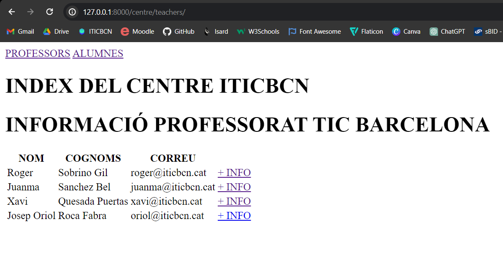
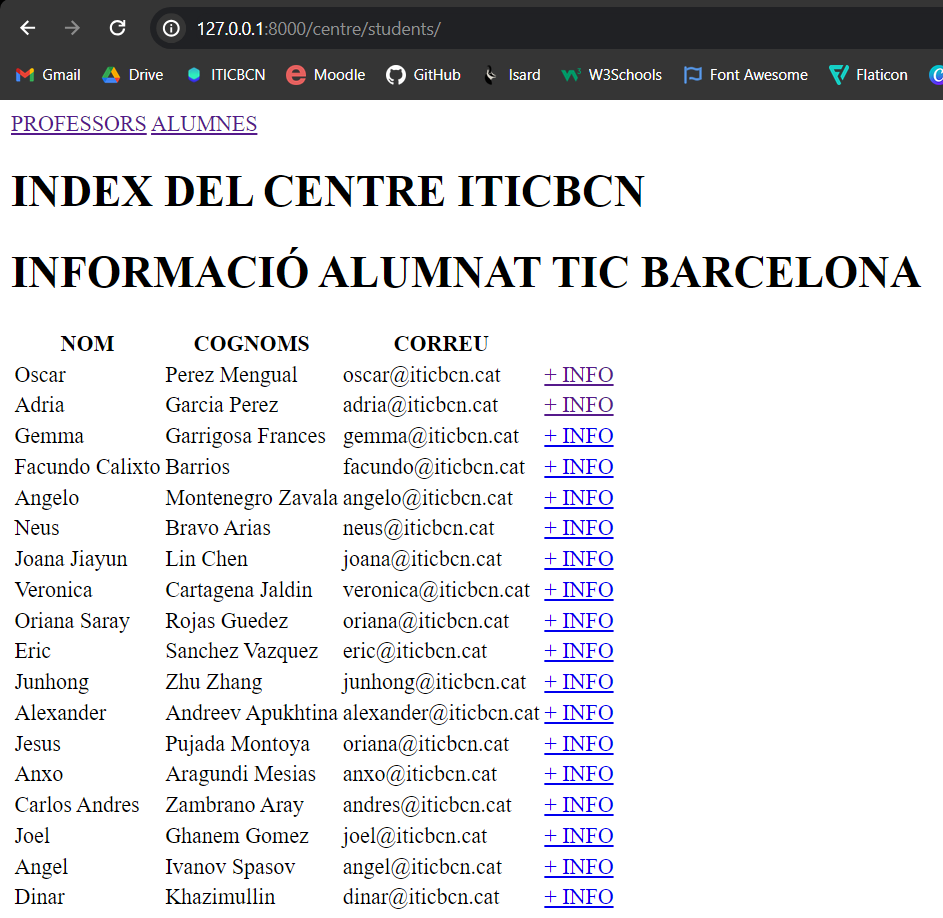
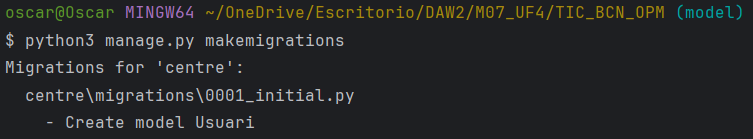
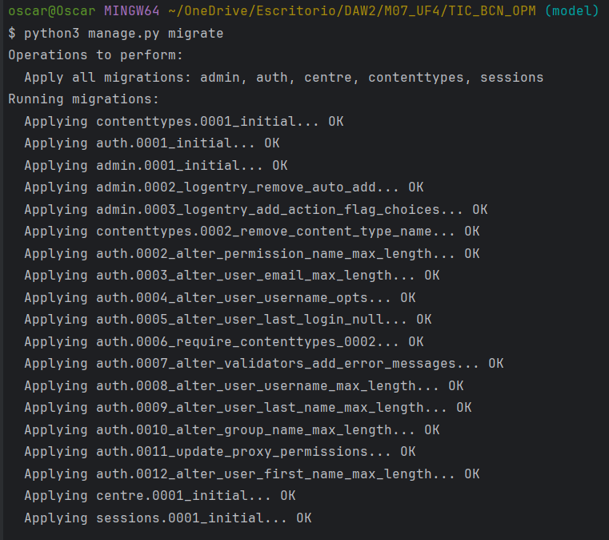
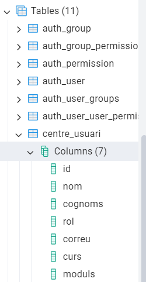
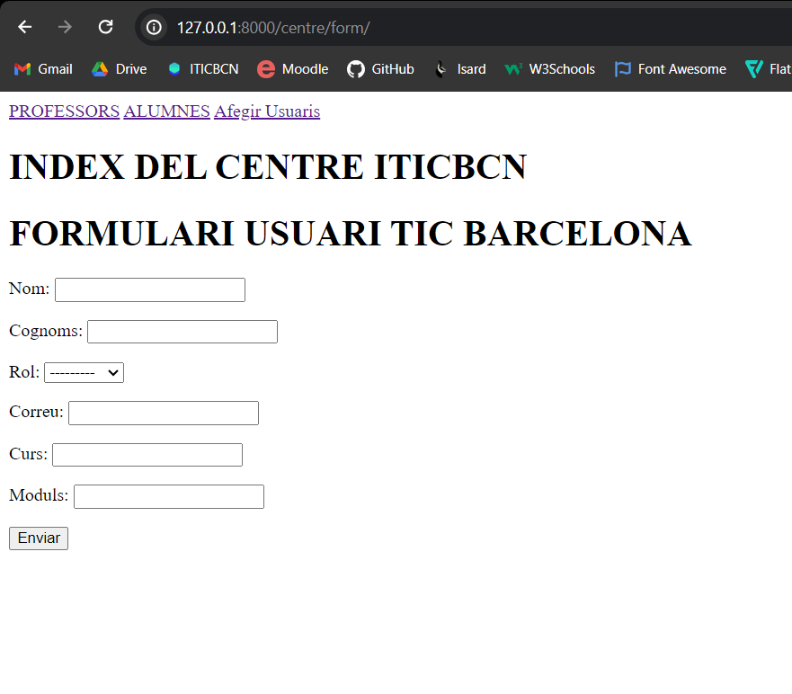
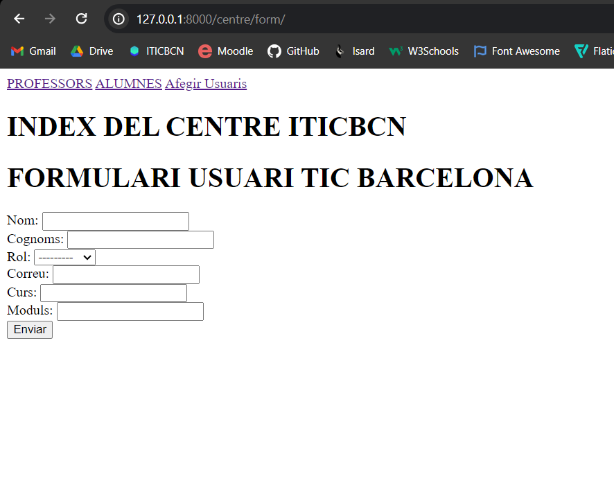

# M07_UF4 PRACTICA 1

## Part 1

Imatge Teachers

Imatge Students

## Part 2

Vídeo Funcionament
https://drive.google.com/file/d/1HMTr1wpXoU8QD-VwSrMBuAcyDOc6qfo6/view?usp=sharing

# M07_UF4 PRACTICA 2

## Part 1

Imatges Migrations

Imatge BD

Video Funcionament
https://drive.google.com/file/d/1dKFlvq0ATK4Kfl_nK5THbSxbtAOecNPY/view?usp=sharing

# M07_UF4 PRACTICA 3

Imatge Formulari amb as_p

Imatge Formulari sense as_p

# M07_UF4 PRACTICA 4

Video Funcionament
https://drive.google.com/file/d/1GFvhtxAeE--PE01mat38_xmMrRpnMRoG/view?usp=sharing

## CREATE

Després de fer CREATE (Student)

Després de fer CREATE (Teacher)

Després de fer UPDATE (Student)

Després de fer UPDATE (Teacher)

Després de fer DELETE (Student)

Després de fer DELETE (Teacher)

